Spring boot使用vault
(1)新建springboot项目，并进行启动
我这里使用脚手架形式来创建，如果自己idea方便使用idea创建最好，
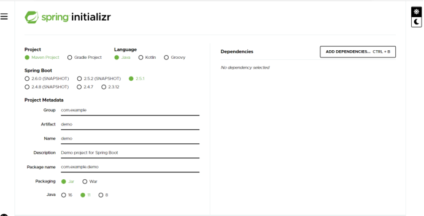
创建完后看到项目内部
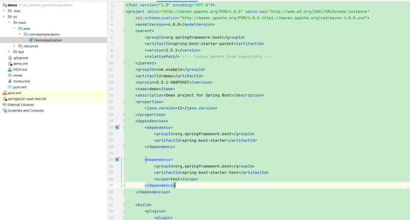
此时启动一下，有时候你会发现启动失败
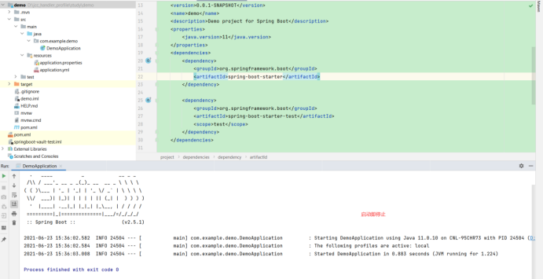
此时pom文件中增加
<dependency>
			<groupId>org.springframework.boot</groupId>
			<artifactId>spring-boot-starter-web</artifactId>
		</dependency>
然后就启动成功了
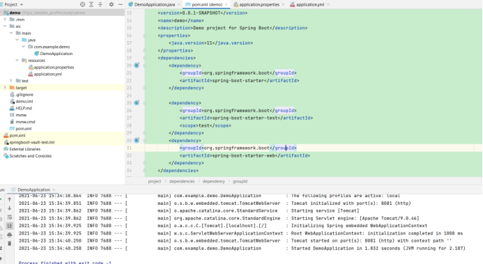
(2)导包,导入vault相关包
在pom文件中导入如下包
<dependency>
            <groupId>org.springframework.cloud</groupId>
            <artifactId>spring-cloud-starter-vault-config</artifactId>
        </dependency>
然后启动下看看是否有错误，接下来就是读取配置了，首先要在vault页面上配置信息
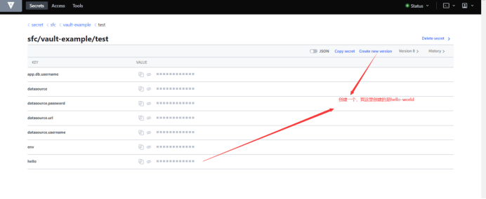

接下来就是配置yml地址
(3)配置yml
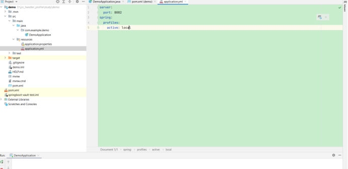
在application.yml中增加vault内容
cloud:
    config:
      profile: test #最后文件目录地址
application:
    name: vault-example #vault地址
    vault:
      enabled: true
      host:XXX #主机地址 
      port: 443 #主机端口
      scheme: https #请求方式
      connection-timeout: 5000
      read-timeout: 15000
      authentication: XXX
      app-role:
        role-id: XXXX
        secret-id:XXX
        app-auth-path: XXX
          generic:
        	application-name: XXXX
        	default-context:XXXX
      	kv:
        	enabled: true
        	application-name: XXX
        	default-context: XXX
(4)输出打印
写一个controller来测试下,
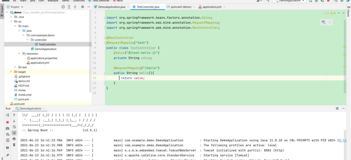
你会惊奇的发现配置完后重新启动反而失败了
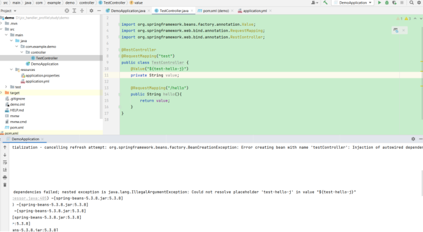
为什么呢？这里要解释下，因为vault是通过cloud包下执行的所以这里要有cloud的支持，从官网来讲cloud支持需要cloud-bootstrap支持，那么我们来导入这个包
 <dependency>
            <groupId>org.springframework.cloud</groupId>
            <artifactId>spring-cloud-starter-bootstrap</artifactId>
        </dependency>
在pom中添加上方文本，再次启动，又报错了
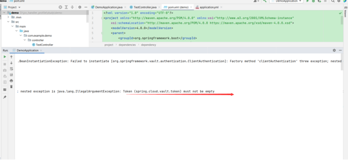
说是缺少token，接下来就算加了token一样会报错的，什么原因呢？因为用的是cloud-bootstrap，所以vault配置信息应该放在bootstrap.yml下才对，那接下来就创建bootstrap.yml这个文件,创建bootstrap.yml并填入以下内容,同时删除application.yml中同样的内容
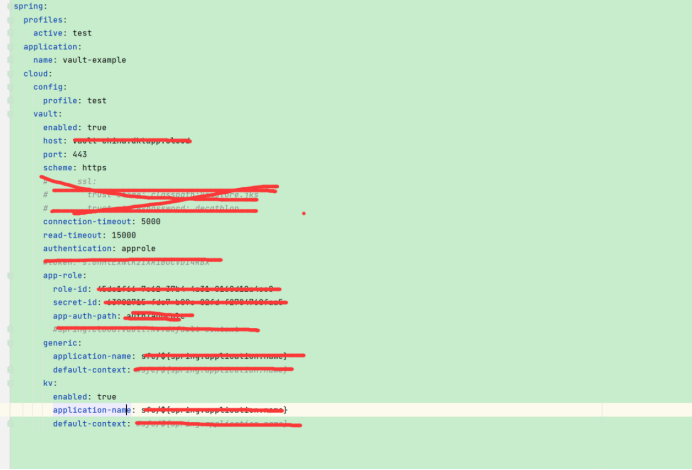
配置完成了，接下来就是打印hello-word，启动项目，网页访问http://localhost:8080/test/hello
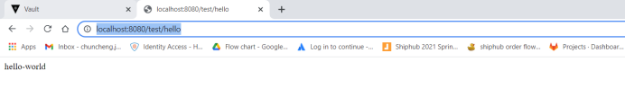
访问成功,一阶段完成，此时可以读取vault中的内容了。
(5)导入database相关
其他配置特别是database相关的要如何配置呢，首先在项目pom文件中导入对应包，
<dependency>
			<groupId>org.springframework.boot</groupId>
			<artifactId>spring-boot-starter-jdbc</artifactId>
		</dependency>
		<dependency>
			<groupId>org.springframework.boot</groupId>
			<artifactId>spring-boot-starter-data-jdbc</artifactId>
		</dependency>
		<dependency>
			<groupId>mysql</groupId>
			<artifactId>mysql-connector-java</artifactId>
			<scope>runtime</scope>
		</dependency>
		<dependency>
			<groupId>org.mybatis.spring.boot</groupId>
			<artifactId>mybatis-spring-boot-starter</artifactId>
			<version>1.3.2</version>
		</dependency>
		<dependency>
			<groupId>org.mybatis</groupId>
			<artifactId>mybatis</artifactId>
			<version>3.4.4</version>
		</dependency>
(6)配置database
然后要在vault中配置database相关的，配置信息如下：
在vault/secret下创建database,然后新建目录source_业务下创建数据相关信息，
username:XXX
password: XXX
url:XXX
Timeout:XXX
配置完成后，在application.yml中配置对应信息，格式如下:
spring:
  config:
    import: vault://secret/ database/XXXX
  datasource:
    username: ${username}
    password: ${password}
    url: ${url}
    driver-class-name: com.mysql.cj.jdbc.Driver
然后开始配置一个sql查询功能,要配置的目录包括controller,service,dao,entity等，其余功能跟着本项目来操作吧！